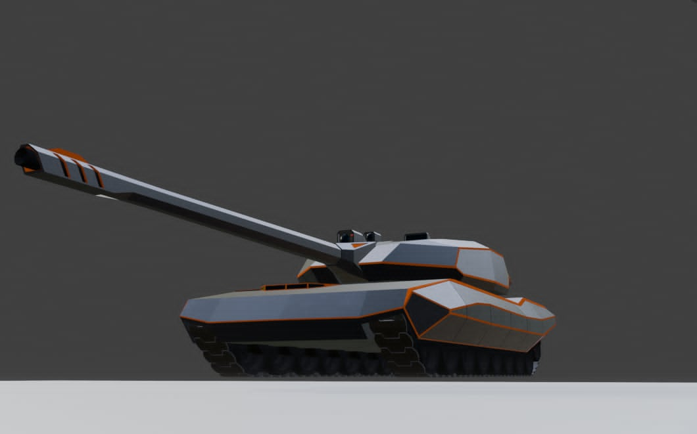
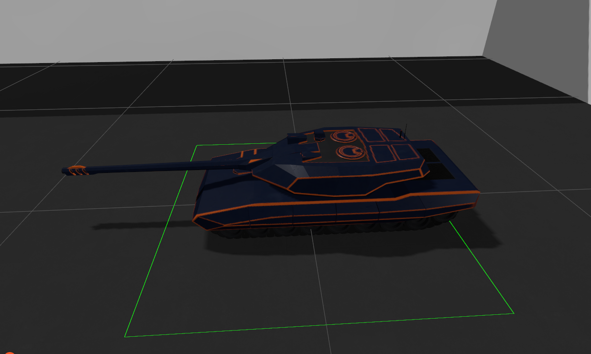
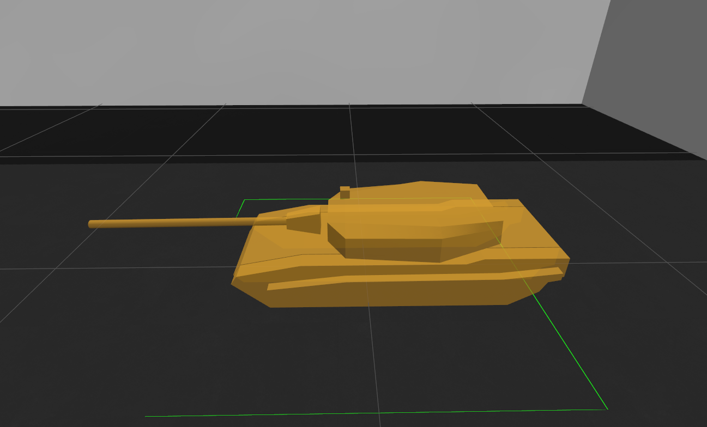
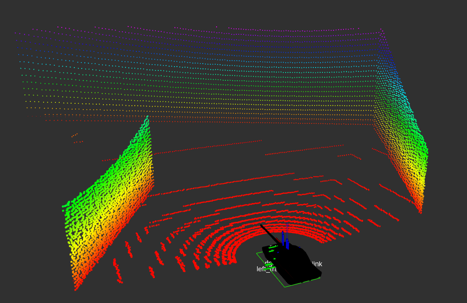
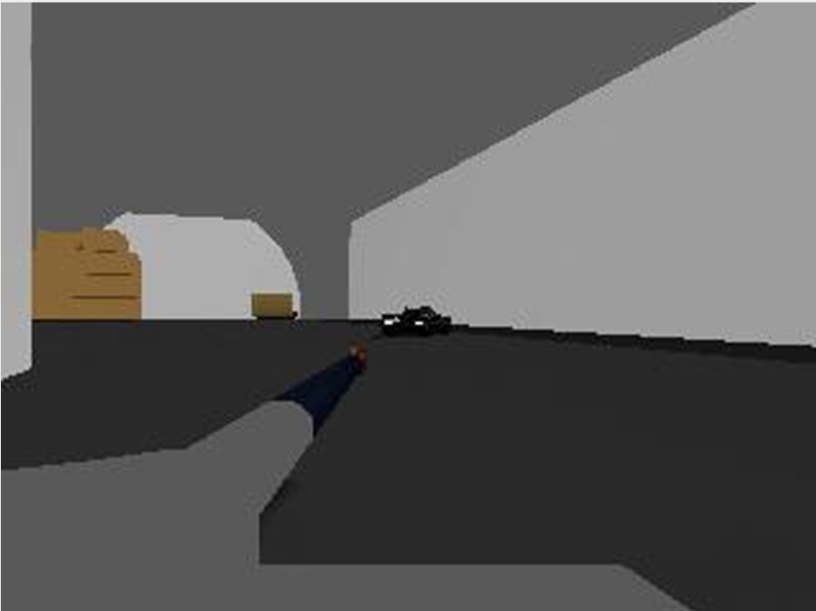
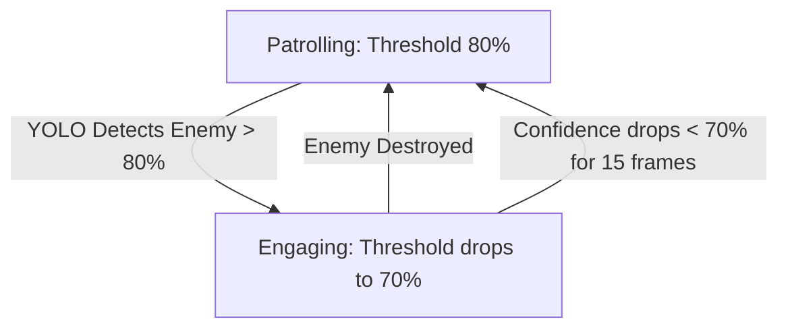
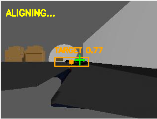
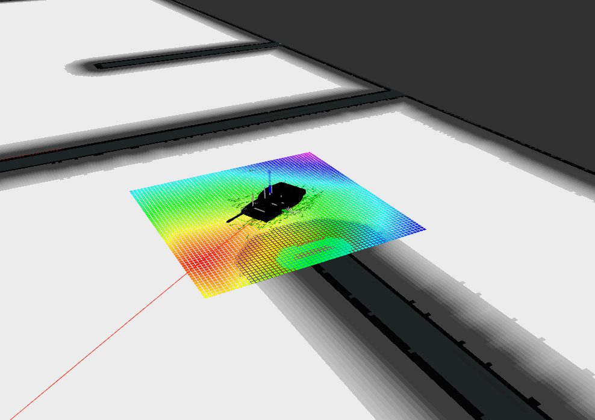

# Autonomous Tank Simulation using ROS 2 and Gazebo

[](https://docs.ros.org/)
[](https://gazebosim.org/)
[](https://ultralytics.com/)

This repository contains a fully autonomous mobile robot (toy tank) simulation operating in an indoor environment populated with enemy targets. The system integrates autonomous navigation via Nav2, real-time target identification using a custom-trained YOLOv8 neural network, and a precise ballistic, hysteresis-based weapon control system.

[](https://youtu.be/bAI-MWE6F9M)

---

## 1. Introduction and Project Overview

The primary objective of the system is to simulate a combat-capable tracked robot tank toy that can:
* Autonomously patrol an indoor environment along predefined waypoints.
* Detect enemy units in real time using visual data.
* Intercept target positions, calculate ballistic firing solutions, and eliminate targets.
* Resume the patrol mission, once the target is successfully destroyed.

---

## 2. Tank URDF Design and Physical Simulation

The tank is modeled using URDF (Xacro) specifications. To ensure simulation stability, visual representation and physical collision models are separated.

### 2.1. Visual vs. Collision Models
To maintain high simulation fidelity while ensuring numerical stability in the physics engine (ODE), the vehicle's geometry is strictly decoupled into two distinct layers:

* **Visual Layer (`.glb`):** High-poly models generated in Blender, containing complex shapes and embedded PBR textures optimized for the Ogre2 rendering engine.
* **Collision Layer (`.stl`):** Low-poly, simplified geometric shapes designed in Autodesk Inventor. These simplified meshes reduce the contact point density, eliminating `Trimesh-trimesh` contact hash table bucket overflow errors and high-frequency vibrations during track-to-ground contact.

> **Blender to Gazebo GLB Export Guidelines:**
> To ensure correct rendering and pose matching in Gazebo Sim, the visual meshes were exported from Blender using the following constraints:
> 1. **Apply Transformations:** All scales, rotations, and locations were baked into the mesh data prior to export to align the mesh origin with the physical link origin.
> 2. **Material Embedding:** PBR materials were bundled directly into the `.glb` container for seamless material parsing in the simulator.

#### Visual vs. Collision Mesh Comparison
Below is a visual representation of the optimization process, highlighting the contrast between the high-fidelity visual mesh and the simplified physical collision boundary:

| High-Poly Visual Mesh (Blender `.glb`) | Simplified Collision Mesh (Inventor `.stl`) |
| :---: | :---: |
|  |  |

#### Exact Physical Property Definitions
Rather than using arbitrary approximations, the mass, center of mass, and the inertia tensor matrix were analytically calculated inside **Autodesk Inventor** based on the physical material properties and volumes of the hollow version of the components. 

The following Xacro snippet demonstrates the implementation of these exact mathematical properties alongside the visual and collision mesh references for a track link:

```xml
<link name="left_track_link">
    <inertial>
      <mass value="15.332"/>
      <origin xyz="0 0 0" rpy="0 0 0"/>
      <inertia ixx="0.039134" ixy="0.0" ixz="0.0" 
                               iyy="0.853424" iyz="0.0" 
                                              izz="0.865356" />
    </inertial>

    <collision name='left_track_collision'>
      <origin xyz="0 0 0" rpy="1.57079 0 1.57079"/> 
      <geometry>
        <mesh filename="file:///home/horvathbd/ros_project_ws/src/ROS2_project/tank_robot/meshes/Sim/Enemy/Collision/Enemy_Track_collision.stl" />
      </geometry>
    </collision>

    <visual name="left_track_visual">
      <origin xyz="0 0 0" rpy="0 0 0"/> 
      <geometry>
        <mesh filename="file:///home/horvathbd/ros_project_ws/src/ROS2_project/tank_robot/meshes/Sim/Enemy/Visual/Track.glb"/>
      </geometry>
    </visual>
  </link>
```
### 2.2. Tracked Vehicle Kinematics and Control Plugins

The locomotion of the toy tank utilizes a realistic tracked drivetrain rather than a simplified wheeled differential drive. In Gazebo Sim, this is achieved by deploying a multi-layered plugin architecture that bridges ROS 2 geometry messages with high-fidelity friction and track physics.

#### 2.2.1. The Tracked Vehicle Core (`TrackedVehicle`)
The core synchronization is handled by the `gz::sim::systems::TrackedVehicle` plugin. It acts as the kinematic solver for the robot. It subscribes to the standard ROS 2 velocity command topic (`cmd_vel`), computes the respective linear velocities required for the left and right tracks, and solves the odometry equations.

Crucially for the autonomous navigation stack (Nav2), this plugin broadcasts:
* **The `/odom` topic:** Containing `nav_msgs/msg/Odometry` data (current position and velocity vectors).
* **The TF Tree link:** Dynamically publishing the transformation matrix between the `odom` coordinate frame and the robot's physical root frame (`base_footprint`).

```xml
<plugin name='gz::sim::systems::TrackedVehicle' filename='gz-sim-tracked-vehicle-system'>
  <left_track>
    <link>left_track_link</link>
  </left_track>
  <right_track>
    <link>right_track_link</link>
  </right_track>
  <tracks_separation>0.295542</tracks_separation>
  <tracks_height>0.118371</tracks_height>
  <steering_efficiency>0.5</steering_efficiency>
  <odom_topic>odom</odom_topic>
  <tf_topic>tf</tf_topic>
  <frame_id>odom</frame_id>
  <child_frame_id>base_footprint</child_frame_id>
  <odom_publish_frequency>30</odom_publish_frequency>
  <publish_odom>true</publish_odom>
  <publish_odom_tf>true</publish_odom_tf>
</plugin>
```
#### 2.2.2. Critical Simulation Fix: Rigid Body Fusion (`preserveFixedJoint`)

A major technical challenge arose during the integration of the URDF model with Gazebo Sim. By default, the Gazebo physics parser optimizes the kinematic tree by merging links connected via `fixed` joints into a single rigid body. 

Because the track links (`left_track_link`, `right_track_link`) were rigidly attached to the vehicle's base footprint, Gazebo's internal optimization collapsed these separate entities into the root link. As a direct consequence, the `TrackedVehicle` and `TrackController` plugins failed to locate the designated track frames, breaking the odometry calculation and halting locomotion.

To resolve this structural collapse, explicit Gazebo-specific extensions were injected into the robot description file using the `<preserveFixedJoint>` tag:

```xml
<gazebo reference="left_track_joint">
  <preserveFixedJoint>true</preserveFixedJoint>
</gazebo>

<gazebo reference="right_track_joint">
  <preserveFixedJoint>true</preserveFixedJoint>
</gazebo>
```

## 3. Sensors and Perception

To achieve full autonomy, and target tracking, the tank is equipped with a comprehensive sensor suite simulated natively within Gazebo Sim. The raw data streams are exposed to the ROS 2 ecosystem via the `ros_gz_bridge` transport layer, ensuring synchronization and real-time execution.

---

### 3.1. Sensor Configurations and Topics

The following bridge configuration maps the hardware sensors to standard ROS 2 message types:

| Sensor Type | Gazebo Internal Topic | ROS 2 Topic | ROS 2 Message Type | Purpose |
| :--- | :--- | :--- | :--- | :--- |
| **GPU Lidar** | `/scan` | `/scan` | `sensor_msgs/msg/LaserScan` | Mapping & Nav2 Obstacle Avoidance |
| **IMU** | `/imu` | `/imu` | `sensor_msgs/msg/Imu` | EKF Robot Localization Odom Fusion |
| **RGB Camera** | `/camera/image` | `/camera/image/camera_info` | `sensor_msgs/msg/CameraInfo` | Camera Matrix/Calibration Data |
| **RGB-D Depth** | `/camera/depth_image` | `/camera/depth_image` | `sensor_msgs/msg/Image` | Ballistic Distance Calculation |

---

### 3.2. Detailed Sensor Breakdown

#### 3.2.1. Ray-Based GPU Lidar (`/scan`)
The laser scanner is configured with $340$ horizontal samples ranging from $-1.48$ to $+1.48$ radians, operating at an update rate of $10\text{ Hz}$. It scans the boundaries of the environment up to a maximum distance of $25\text{ meters}$. To simulate real-world conditions, a Gaussian noise parameter with a standard deviation ($\sigma$) of $0.01\text{m}$ is injected into the beam returns. This data is the direct foundation for AMCL localization and costmap inflation layers.

> **What the Tank Sees (Lidar Pointcloud):**
> 

#### 3.2.2. RGB-D Depth Camera (`/camera/depth_image`)
The visual subsystem consists of an RGB-D camera configured with a Horizontal Field of View (FOV) of $1.25\text{ radians}$ and a matrix resolution of $320 \times 240$ pixels. 
* The **RGB compressed stream** is redirected directly to the YOLOv8 inference pipeline.
* The **Depth register matrix** maps distances from a near clipping plane of $0.3\text{m}$ to a far boundary of $15\text{m}$. Each pixel represents an explicit float distance value ($32FC1$), which is queried by the gun controller to determine the exact geometric range of an acquired target.

> **What the Tank Sees (Raw Camera View):**
> 

#### 3.2.3. Inertial Measurement Unit (`/imu`)
The onboard IMU captures linear accelerations along the $X, Y, Z$ axes and angular velocities at a frequency of $50\text{ Hz}$. It utilizes a custom reference frame to align correctly with the vehicle's `base_footprint`. The state vector generated by the IMU is consumed by the `robot_localization` EKF node to damp out slippage errors coming from the track kinematics.
## 4. Computer Vision and YOLOv8 Target Tracking

The visual intelligence and situational awareness of the tank are driven by a custom-trained **YOLOv8** object detection model. The inference pipeline processes the compressed RGB feed from the turret-mounted camera to detect and isolate enemy units in real time.

---

### 4.1. Real-Time Inference Pipeline
The object detection node (`turret_controller`) acts as the primary sensory-trigger for combat mode. To optimize execution speed and reduce GPU load, the image stream is normalized to a resolution of $320 \times 240$ pixels, matching the native output of the camera sensor. The target coordinate vector consisting of the bounding box centroid ($c_x, c_y$) is dynamically extracted and published to the `/target_info` topic to guide the physical actuation loops.

---

### 4.2. Hysteresis-Driven Thresholding (Confidence Hysteresis)
A major challenge in mobile vision robotics is signal noise caused by vehicle vibration, track slippage, or camera shaking while navigating over uneven terrain. A static confidence threshold causes high-frequency chattering (rapidly switching combat mode on and off) when the detection probability oscillates around the threshold limit.

To guarantee system stability, a two-stage **Confidence Hysteresis** control logic was implemented:

1. **Target Acquisition (Search State):** While patrolling peacefully along Nav2 waypoints, the vision system enforces a strict **80% confidence threshold**. This high initial barrier completely eliminates false positives and ensures the tank only stops for verified targets.
2. **Target Engagement (Combat State):** The exact moment a target is locked, the operational threshold drops dynamically to **70%**. This 10% tolerance cushion ensures that even if the tank's motion, or a poor viewing angle degrades the model's confidence temporarily, the combat lock is maintained.
3. **Reset Trigger:** Once the `shoot_controller` confirms the destruction of the target, the threshold boundary instantly snaps back to 80%, restarting the navigation stack.


<p align="center">
  <strong>YOLOv8 Real-Time Target Lock View:</strong><br>
  
</p>

## 5. Weapon Control and Ballistic Targeting

The tank's weapon system coordinates two independent rotational degrees of freedom: turret rotation (Yaw) for tracking and barrel elevation (Pitch) for range compensation. The firing sequence is governed by a state machine that transitions the vehicle from navigation to engagement.

---

### 5.1. Delayed Braking Mechanism (Shoot-on-the-Move Transition)
To maximize kinetic efficiency and maintain smooth odometry profiles, the system does not apply immediate braking upon initial target acquisition. When the YOLOv8 node flags a target above the 80% confidence threshold, a **0.5-second delay timer** is triggered. 

During this brief window, the vehicle continues its forward momentum while the high-velocity turret joint aggressively pivots toward the calculated target centroid. This smooth transition mitigates radical step-changes in the drivetrain velocity controller, preventing wheel/track slippage that could otherwise destabilize the Extended Kalman Filter localization.

---

### 5.2. Ballistic Pitch Calculation
The barrel elevation angle ($\theta$), is dynamically calculated to compensate for gravity, based on the distance to the target. The range ($R$) is sampled directly from the center pixel of the depth image register matrix (`/camera/depth_image`). 

Given a fixed initial muzzle velocity ($v_0 = 15.0\text{ m/s}$) and standard gravitational acceleration ($g = 9.81\text{ m/s}^2$), the embedded solver computes the firing angle using the classical projectile trajectory formula:

$$\theta = \frac{1}{2} \arcsin\left(\frac{g \cdot R}{v_0^2}\right)$$

The computed θ is continuously published to the gun joint position controller. Firing is only enabled once the angular error of both the turret yaw and barrel pitch falls within a strict ±4 pixel window relative to the target centroid.

### 5.3. Firing Mechanism: From Physical Projectiles to Entity Lifecycle Management

Initially, a high-fidelity ballistic simulation was implemented where the tank instantiated a physical projectile entity inside the Gazebo environment upon firing. However, a major simulation constraint was identified during testing: high-speed discrete collision detection in physics engines (like ODE or Dart) frequently suffers from "tunneling" effects. Due to finite physics time-steps, small, fast-moving projectile meshes often pass completely through enemy collision models within a single time frame without triggering a contact event.

To ensure absolute determinism and reliability without inflating the computational overhead of the simulator, a hybrid programmatic workaround was deployed:

1. **Raycasting & Proximity Query:**  Upon pulling the virtual trigger, the shoot_controller queries the global robot transform frame (base_footprint) against the known coordinates of active targets.

2. **Euclidean Distance Validation:** The system calculates the exact Euclidean distance between the tank and the enemy models present in the Gazebo entity tree (enemy_tank_1 through enemy_tank_5).

3. **Deterministic Entity Disposal:** If the target is verified within the weapon's effective sector, the node invokes Gazebo's native service (/gazebo/delete_entity or user command system) to programmatically remove the specific enemy model from the simulation world.

4. **Hardware Cooldown:** Following a successful deletion, the main gun enters a strict 3-second hardware reload phase, locking out further inputs.

#### Architectural Trade-offs and Limitations
While this programmatic entity-deletion method guarantees a 100% hit-detection rate, it introduces a significant structural disadvantage: **the target environment parameters must be hardcoded**. 

Because the distance-calculation loop relies on direct string-matching against the Gazebo entity tree, the exact naming conventions and identification tokens of the enemy targets (`enemy_tank_1-5`) must be explicitly hardcoded into the source code or configuration files. This tight coupling reduces the system's modularity and scalability, as procedurally generating or dynamically spawning randomized enemies at runtime would require restructuring the node's lookup arrays.

## 6. Navigation and Autonomy (Nav2)

The high-level fleet autonomy, path planning, and localization are driven by the **Nav2** framework. The architecture ensures that the tank can reliably traverse the indoor map while dynamically handling unexpected obstacles and transitioning between patrolling and combat states.

---

### 6.1. Sensor Fusion and Localization (AMCL + EKF)
To achieve sub-centimeter positioning accuracy within the pre-mapped environment, the system utilizes a dual-layer localization pipeline:
* **AMCL (Adaptive Monte Carlo Localization):** This node consumes the `/scan` Lidar topic and matches the laser return geometries against the static map. It continuously updates a particle cloud to estimate the robot's $X, Y$ coordinates and orientation.
* **Robot Localization (EKF):** An Extended Kalman Filter node fuses the high-frequency inertial data from the `/imu` and the odometry increments from the `TrackedVehicle` plugin. This smooths out high-frequency sensor noise and limits drift during sudden stops.

---

### 6.2. Two-Dimensional Costmaps
Path planning is separated into two distinct costmap layers configured via `nav2_params.yaml`:
1. **Global Costmap:** Used by the `NavfnPlanner` plugin to calculate the most efficient, collision-free macro-trajectory from the tank's current position to the active waypoint.
2. **Local Costmap:** A highly dynamic $60 \times 60$ cell rolling window centered on the robot. The `RPP (Regulated Pure Pursuit)` or `DWB` controller server uses this layer to compute real-time velocity vectors (`cmd_vel`), safely steering the tank around unexpected obsticles.

---

### 6.3. Waypoint Engine and State Suspension Loop
The autonomous patrol sequence is managed by a custom lifecycle interface cooperating with the Nav2 Action Server:

1. **Mission Loading:** At startup, the `turret_controller` parses a coordinate array from `waypoints.yaml`. The initial waypoint is dispatched to the `/goal_pose` action topic after a 15-second safety delay to allow all Nav2 lifecycles to stabilize.
2. **Asynchronous Interruption:** The moment the YOLOv8 vision pipeline triggers Combat Mode (Target Confidence > 80%), a high-priority interrupt is executed. The node invokes the `CancelGoal` service on the `/navigate_to_pose` action server, forcing the drivetrain to a controlled halt while freeing up processor cycles for turret tracking.
3. **Mission Resumption:** Once the target entity is eliminated and removed from the Gazebo world tree, the combat state flags drop. The controller queries the current stable TF transform (`map -> base_footprint`), validates the current coordinates via AMCL, and re-dispatches the exact same waypoint index, seamlessly resuming the patrol route.

> **Autonomous Path Planning and Costmap Layer View in RViz:**
> 

#### Combat-Induced Relocalization (Pose Injection)
A known vulnerability in 2D LiDAR navigation is the "Kidnapped Robot Problem" (AMCL Aliasing). During the aggressive braking and turret-slewing maneuvers required for combat, the AMCL particle filter can easily become disoriented, especially in feature-poor environments like symmetrical corridors. This disorientation causes the navigation stack to completely halt after an engagement.

To ensure absolute mission continuity, a **Pose Injection** mechanism was engineered into the state machine:
1. **Pre-Combat Caching:** While patrolling, the `turret_controller` continuously caches the highly-confident `amcl_pose`.
2. **Combat Lock:** The moment a threat is verified, the pose-caching is suspended, preserving the last known safe coordinates.
3. **Post-Combat Injection:** Immediately after the enemy is destroyed, the controller forcibly publishes the cached coordinates back to the `/initialpose` topic. 
4. **Safety Delay:** A 1.0-second delay is injected before dispatching the next Nav2 goal, allowing the AMCL node and local costmaps to successfully redraw their particle clouds and TF tree, ensuring a flawless resumption of the patrol route.

## 7. Future Work and Development Opportunities

While the current architecture successfully achieves its core objectives, several engineering milestones have been identified to increase the system's modularity, realism, and adaptation to complex environments.

---

### 7.1. Upgrading to a 360° LiDAR Sensor
The current sensor configuration utilizes a $170^\circ$ Field of View LiDAR. While this angular coverage is perfectly adequate for reactive obstacle avoidance and localization on a pre-mapped static environment using Nav2, it introduces limitations in unexplored spaces. Upgrading the hardware stack to a full $360^\circ$ LiDAR would enable robust Simultaneous Localization and Mapping (SLAM) capabilities, allowing the tank to autonomously map completely unknown frontier zones during its patrol.

---

### 7.2. Omnidirectional Vision and Advanced Targeting Systems
Currently, target detection is limited to the front-facing camera's sector. A major development step would involve deploying an omnidirectional camera array (e.g., a 360-degree panoramic sensor or four orthogonal cameras). 

Implementing this would require upgrading the targeting backend. Instead of calculating a simple pixel-offset from a single camera frame, a sophisticated coordinate transformation matrix would be deployed to project detected bounding box pixels into the robot’s absolute 3D coordinate system, enabling the turret to spin and lock onto threats approaching from the rear or sides.

---

### 7.3. Dataset Expansion, Extended Training, and Camera Resolution Scaling
The current object detection framework relies on a lightweight, proof-of-concept YOLOv8 model. Due to hardware and time constraints during the initial development phase, the model was trained on a minimal dataset of approximately 60 images for 50 epochs. While sufficient for basic classification within a controlled environment, this severely limits the network's robustness, edge-case generalization, and mean Average Precision.

To achieve production-grade detection reliability, the vision pipeline will be upgraded via:
* **Dataset Scaling and Data Augmentation:** Expanding the training repository to thousands of unique images featuring diverse lighting profiles, synthetic smoke, severe occlusions, and varied camera angles. Applying augmentation techniques (mosaic, rotation, hue adjustments) will further prevent overfitting.
* **Extended Training Regimes:** Re-training the architecture for 300+ epochs utilizing early-stopping callbacks and hyperparameter tuning to optimize the model's loss convergence.
* **Camera Resolution Scaling:** The current $320 \times 240$ pixel resolution, while computationally efficient, limits long-range target detection because distant targets occupy too few pixels to generate a high-confidence bounding box. Upgrading the RGB-D camera to a higher resolution (e.g., $640 \times 480$ or $1280 \times 720$) will drastically increase the detection range and the tracking accuracy of the centroid offset. To compensate for the increased computational load, hardware acceleration toolkits such as **NVIDIA TensorRT** or **Intel OpenVINO** will be integrated into the deployment node to maintain real-time execution speeds.

---

### 7.4. High-Fidelity Physics and Alternative Simulation Engines
To overcome the discrete collision "tunneling" limitation of Gazebo’s physics engines (which necessitated the programmatic entity-deletion workaround), migrating the simulation environment to **Unity** (leveraging the *Unity Robotics Hub* and *ROS-TCP-Connector*) represents a viable alternative. 

Unity’s continuous collision detection algorithms and advanced rigid-body physics would allow for high-fidelity physical projectile simulation and realistic impact dynamics. However, this introduces a classic system trade-off, as implementing and calibrating standardized ROS 2 sensor plugins (like LiDAR point clouds or IMU noise matrices) requires significantly higher development overhead in Unity than in native Gazebo Sim.

---

### 7.5. Transitioning from 2D Autonomy to True 3D Navigation
The most significant evolutionary step for the project is breaking out of the flat 2D plane. Real-world combat scenarios involve complex 3D topographies, including ramps, debris piles, and multi-level structures. 

Transitioning to true 3D autonomy would require:
* Replacing 2D costmaps with 3D voxel grids (using plugins like `Spatio-Temporal Voxel Layer`).
* Upgrading the localization suite from 2D AMCL to a 3D graph-based SLAM or visual-inertial odometry framework (such as `RTAB-Map` or `ORB-SLAM3`).
* Accounting for pitch and roll variables in the ballistic controller to maintain targeting locks while climbing slopes.
